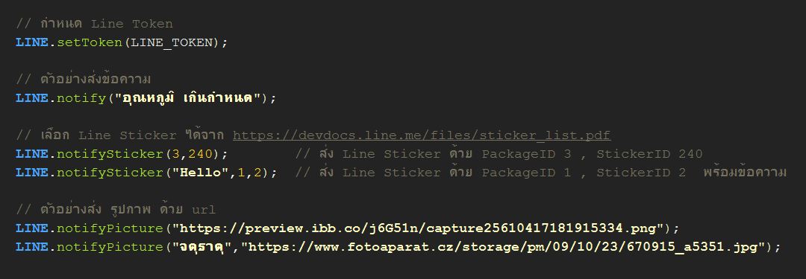
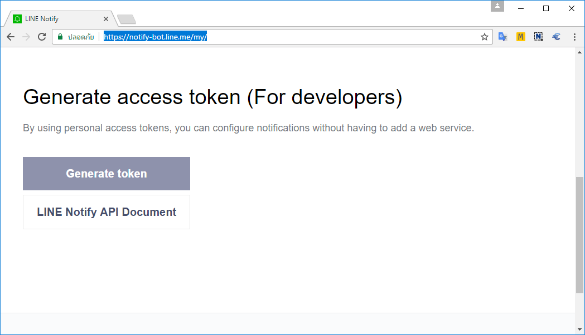
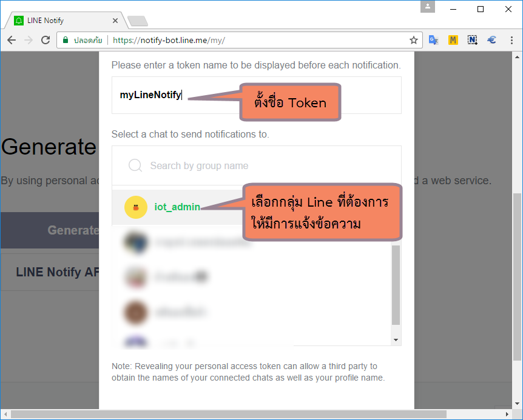

TridentTD_LineNotify 
============
  
TridentTD_LineNotify เป็นไลบรารี่สำหรับส่งเตือนเข้า Line Notify
โดยสามารถใช้ได้กับ ESP8266 และ ESP32    
สามารถส่งได้ทั้ง ข้อความ สติ๊กเกอร์ และ รูปภาพด้วย URL ได้  
ความสามารถในการส่ง หากส่งไม่สำเร็จจะพยายามส่งให้ใหม่อัตโนมัติ 3 ครั้ง 

ตัวอย่างการส่ง  
--------------
 วิธีใช้จะค่อนข้างง่าย  
 * หากส่งข้อความ ใช้คำสั่ง LINE.notify( .... );  
 * หากส่งสติ๊กเกอร์ ใช้คำสั่ง LINE.notifySticker( .... );  
   โดยสามารถเลือกสติ๊กเกอร์ได้จาก https://devdocs.line.me/files/sticker_list.pdf  
 * หากส่งรูปภาพด้วย URL ใช้คำสั่ง LINE.notifyPicture( .... );  
  
 โดยการส่งค่าไปยัง LINE สำเร็จฟังกชั่นจะคืนค่าเป็น true หากไม่สำเร็จจะคืนค่าเป็น false คืนกลับมาให้  

  
  
  **หมายเหตุ** 
  สำหรับภาษาไทยจะส่ง LINE ได้ให้ save ไฟล์ใน ArduinoIDE ออกมาก่อน  
  จึงจะส่งภาษาไทยไปยัง LINE ได้  

วิธีสร้าง Line Token
---------------------------------------------

ทำการ Log in ที่ https://notify-bot.line.me/en/

  

จากนั้น เข้าไปที่ https://notify-bot.line.me/my/  เพื่อทำการ สร้าง Line Token ขึ้นมา
ให้กดปุ่ม **Generate token**

ตั้งชื่อ Token อะไรก็ได้
พร้อมทั้งเลือก กลุ่มใน Line ที่ต้องการให้มีการแจ้งเตือนไปยังกลุ่ม

## หมายเหตุ
วิธีการใช้งาน โดยละเอียด โดยคุณประภาส 
http://www.praphas.com/forum/index.php?topic=356.0  
  
วิธีทำ IP Camera ส่งแจ้งเตือน Line Notify.  
โดยละเอียด โดยคุณ MaxMac.  
https://maxmacstn.wordpress.com/2019/06/16/diy-esp8266-doorbell-mod/
  
วิธีทำ ESP32 Camera Line Notify โดยคุณ S Bit  
**ESP32 CAM ส่งภาพแจ้งเตือนด้วย LINE Notify เมื่อมีผู้บุกรุก esp32 camera line notify**  
https://www.youtube.com/watch?v=I-HbdRWwMVY 
  
Version
=====

1.0.0  TridentTD_LineNotify  
1.1    เพิ่ม ให้ส่งซ้ำอัตโนมัติ หากส่งไม่ได้ 3 หน, สามารถส่งแบบตัวเลข หรือ ทศนิยมได้  
2.0    เพิ่มความสามารถส่ง ข้อความ สติ๊กเกอร์ และ รูปภาพได้   
2.1    ปรับโคดให้มีขนาดเล็กลง กระทัดรัดขึ้น  
2.2    เพิ่ม notify(ตัวเลข) ได้ด้วย  
2.3    rename DEBUG_PRINT  
2.4    สนับสนุน Arduino ESP8266 ทุก version จนไปถึง version ล่าสุด 2.5.0-rc1, 2.5.0-rc2  
3.0    เพิ่ม คำสั่งให้ส่ง Jpg File ที่อยู่บน SPIFFS หรือ SD รวมทั้ง jpg data ออกไปได้ด้วย  
3.0.1  ทำความสะอาดบรรทัดที่เกินมา 1 บรรทัดตอนท้าย เวลาส่งเฉพาะข้อความ ( request by K'Kik boonsug )  

